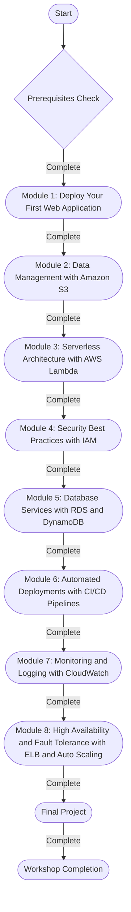
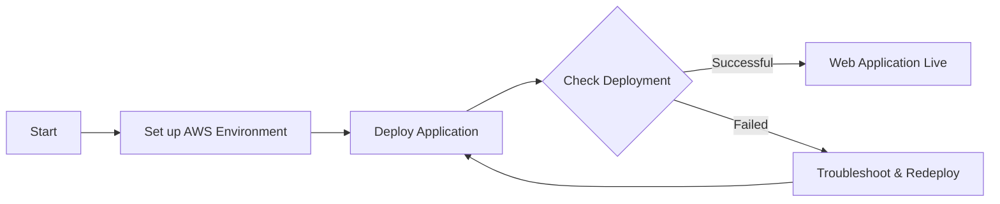
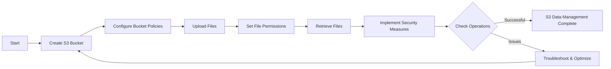
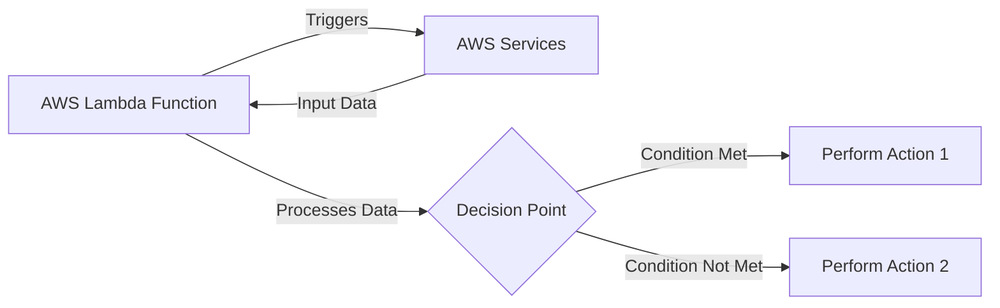
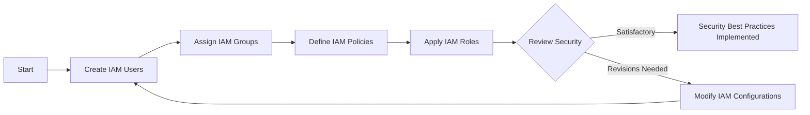
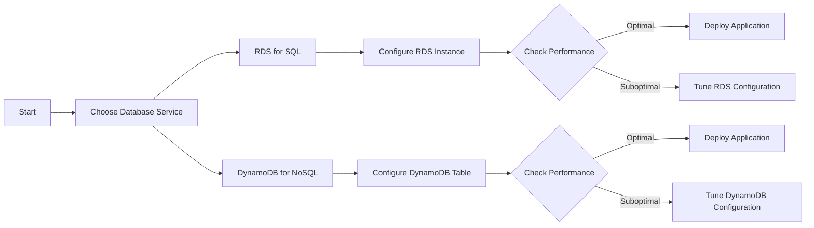
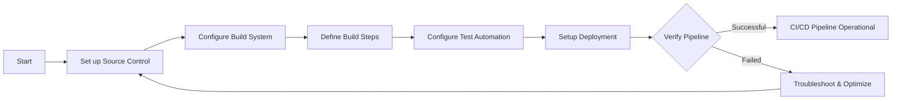
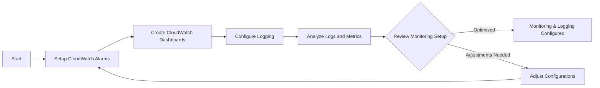
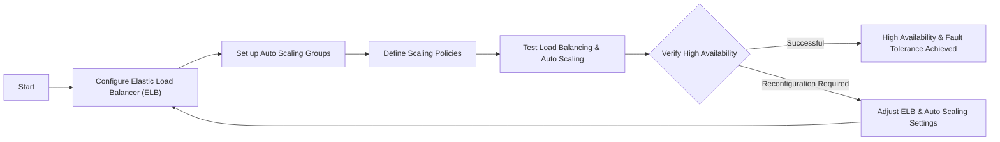
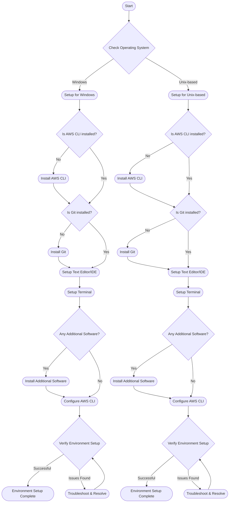

# AWS Starter Workshop

**Unlock the Full Potential of Cloud Computing with AWS**

## Workshop Progress

□□□□□□□□ 0% Complete

Complete the following modules:

- [ ] Module 1: Deploy Your First Web Application
- [ ] Module 2: Data Management with Amazon S3
- [ ] Module 3: Serverless Architecture with AWS Lambda
- [ ] Module 4: Security Best Practices with IAM
- [ ] Module 5: Database Services with RDS and DynamoDB
- [ ] Module 6: Automated Deployments with CI/CD Pipelines
- [ ] Module 7: Monitoring and Logging with CloudWatch
- [ ] Module 8: High Availability and Fault Tolerance with ELB and Auto Scaling


## Table of Contents
- [Welcome](#welcome)
- [Workshop Progress](#workshop-progress)
- [Target Audience](#target-audience)
- [Workshop Overview](#workshop-overview)
  - [Modules Overview](#modules-overview)
  - [Getting Started](#getting-started)
- [Installation & Setup](#installation-and-setup-instructions)
- [Feedback & Support](#feedback-&-Support)
- [Conclusion and Next Steps](#conclusion-and-next-steps)

## Welcome

Welcome to the AWS Starter Workshop! Dive into the practical, hands-on world of cloud computing with Amazon Web Services. This workshop is designed for learners of all levels to build, innovate, and scale real-world applications using AWS. From deploying your first web application to mastering advanced services, embark on this journey to transform the way you think about and work with cloud computing.

## Pre-Workshop Survey

To ensure the AWS Starter Workshop meets your needs and expectations, we invite you to complete a brief pre-workshop survey. Your feedback will help us tailor the content and pace of the workshop, ensuring a personalized and effective learning experience.

### Why Take the Survey?
- **Customize Your Learning:** Your responses will help us understand your prior knowledge, skills, and specific areas of interest, allowing us to focus on content that is most relevant to you.
- **Set the Right Pace:** By knowing your background, we can adjust the pace of the workshop to match the collective proficiency level of the participants.
- **Maximize Engagement:** Your input on what you hope to achieve will enable us to align the workshop's interactive elements, such as group activities, discussions, and hands-on labs, with your learning goals.

### [Take the Pre-Workshop Survey](https://www.menti.com/aleeoesfs3p1)


## Target Audience

- **Beginners:** Start your journey into cloud computing and AWS.
- **Intermediate Users:** Solidify your understanding and explore advanced AWS services.
- **Professionals:** Enhance your skills in cloud architecture, development, and operations.

## Prerequisites

Before you begin the AWS Starter Workshop, ensure that you meet the following prerequisites to get the most out of the experience:

1. **AWS Knowledge:**
   - **Beginners:** No prior AWS experience is required. Familiarity with cloud computing concepts is beneficial.
   - **Intermediate and Professionals:** Basic understanding of AWS services such as EC2, S3, and IAM is expected.

2. **Programming Knowledge:**
   - Comfortable with at least one programming language (preferably Python, JavaScript, or Node.js).
   - Understanding of basic programming concepts like functions, loops, and conditionals.

3. **Development Environment:**
   - Access to a computer with an internet connection.
   - Operating System: Familiarity with a Unix-based OS (Linux/Mac) or Windows.

4. **Software Requirements:**
   - AWS CLI: Version 2.x installed and configured. [Installation guide](https://aws.amazon.com/cli/)
   - Git: Version 2.x or later. [Installation guide](https://git-scm.com/book/en/v2/Getting-Started-Installing-Git)
   - Text Editor or IDE: Familiarity with VSCode, Sublime Text, Atom, or any preferred editor.
   - Terminal: Comfortable using the command line interface (CLI).

5. **AWS Account:**
   - An active AWS account. If you do not have one, you can create an account at [aws.amazon.com](https://aws.amazon.com/). Be mindful of the services that may incur costs.

By meeting these prerequisites, you'll be well-prepared to dive into the workshop's content and fully engage with the hands-on tasks. If you're new to some of the concepts or tools, we recommend familiarizing yourself with them before starting the workshop.


## Workshop Overview

This workshop offers an immersive learning experience with a practical, hands-on approach. Below is an overview of the modules included in this workshop. Each module introduces you to a core aspect of AWS, accompanied by tasks and projects that mirror real-world scenarios. Click on the module names to navigate to their respective directories for detailed instructions.



### Modules Overview

1. **[Module 1: Deploy Your First Web Application](/module1)**
    - **Objective:** Learn the basics of AWS deployment by launching a pre-made application.
    - **Tasks:** Set up your AWS environment, deploy a sample application using AWS Elastic Beanstalk.
    - **Estimated Completion Time:** 3 hours
    - **Real-world Application:** Discussion on how businesses scale and manage web applications on AWS.
  

- Access your [AWS Elastic Beanstalk Console](https://console.aws.amazon.com/elasticbeanstalk/) to deploy your application.
- Refer to the [AWS Elastic Beanstalk Developer Guide](https://docs.aws.amazon.com/elasticbeanstalk/latest/dg/Welcome.html) for detailed instructions.

	  

	
**[Complete Module 1 - Update Progress](#workshop-progress)**

2. **[Module 2: Data Management with Amazon S3](/module2)**
    - **Objective:** Understand data storage and retrieval in the cloud using Amazon S3.
    - **Tasks:** Create and configure an S3 bucket, upload, retrieve, and manage files, implement bucket policies and security.
    - **Estimated Completion Time:** 2 hours
    - **Industry Application:** Case studies on S3 for backup, content delivery, and disaster recovery.
  

- Open your [Amazon S3 Console](https://console.aws.amazon.com/s3/) to manage your storage.
- Understand in-depth with the [Amazon S3 User Guide](https://docs.aws.amazon.com/AmazonS3/latest/userguide/Welcome.html).



	
**[Complete Module 2 - Update Progress](#workshop-progress)**

3. **[Module 3: Serverless Architecture with AWS Lambda](/module3)**
    - **Objective:** Dive into serverless computing and learn how to build and deploy AWS Lambda functions.
    - **Tasks:** Create a Lambda function to process data, integrate Lambda with other AWS services (e.g., S3, API Gateway).
    - **Estimated Completion Time:** 4 hours
    - **Real-world Case Study:** Explore how companies optimize operations and reduce costs with serverless architectures.


	
**[Complete Module 3 - Update Progress](#workshop-progress)**

4. **[Module 4: Security Best Practices with IAM](/module4)**
    - **Objective:** Master AWS Identity and Access Management (IAM) to manage access to your AWS resources securely.
    - **Tasks:** Create and manage IAM users, groups, and policies, explore IAM best practices.
    - **Estimated Completion Time:** 2 hours
    - **Real-world Application:** Analyze how robust IAM policies help safeguard cloud infrastructure.



**[Complete Module 4 - Update Progress](#workshop-progress)**

5. **[Module 5: Database Services with RDS and DynamoDB](/module5)**
    - **Objective:** Understand AWS database services, focusing on Amazon RDS and DynamoDB.
    - **Tasks:** Set up RDS for relational databases, explore DynamoDB for NoSQL database needs.
    - **Estimated Completion Time:** 3 hours
    - **Industry Application:** Case studies on how businesses leverage these database services for scalability and performance.


**[Complete Module 5 - Update Progress](#workshop-progress)**

6. **[Module 6: Automated Deployments with CI/CD Pipelines](/module6)**
    - **Objective:** Learn about Continuous Integration and Continuous Deployment (CI/CD) using AWS CodePipeline and AWS CodeBuild.
    - **Tasks:** Create a basic CI/CD pipeline for automated testing and deployment.
    - **Estimated Completion Time:** 4 hours
    - **Real-world Case Study:** Discuss how CI/CD pipelines enhance software development and deployment processes.



**[Complete Module 6 - Update Progress](#workshop-progress)**

7. **[Module 7: Monitoring and Logging with CloudWatch](/module7)**
    - **Objective:** Learn to monitor applications and AWS environment using Amazon CloudWatch.
    - **Tasks:** Set up alarms, create dashboards, and explore logging for resource monitoring.
    - **Estimated Completion Time:** 3 hours
    - **Industry Application:** Examine how effective monitoring and logging can prevent potential issues and optimize cloud operations.



**[Complete Module 7 - Update Progress](#workshop-progress)**

8. **[Module 8: High Availability and Fault Tolerance with ELB and Auto Scaling](/module8)**
    - **Objective:** Ensure high availability and fault tolerance in your AWS applications using Elastic Load Balancing (ELB) and Auto Scaling.
    - **Tasks:** Configure an ELB, set up Auto Scaling groups, create scaling policies.
    - **Estimated Completion Time:** 3.5 hours
    - **Real-world Case Study:** Explore how businesses maintain application performance and availability during varying load conditions.



**[Complete Module 8 - Update Progress](#workshop-progress)**

## Comprehensive Workshop Quiz

After completing all modules in the AWS Starter Workshop, reinforce your understanding and test your knowledge by taking the comprehensive quiz. This quiz covers key concepts and tasks from each module, ensuring you have grasped the essential aspects of cloud computing with AWS.

[Start the Comprehensive Quiz](https://www.menti.com/alsn88mc4hqe)

### Tips for Taking the Quiz:
- Review the key points from each module before starting the quiz.
- Refer to the module content if you are unsure about a question.
- Take notes on any questions you find challenging for further review.

We encourage you to complete the quiz to solidify your learning experience and identify areas where you might need further review or practice.

## Supplementary Resources

To further enrich your learning experience and provide comprehensive insights into each topic, we've compiled a list of supplementary resources for each module. These resources include official AWS documentation, in-depth articles, tutorials, and insightful videos that complement and expand upon the content covered in the workshop.

### Module 1: Deploy Your First Web Application
- [AWS Elastic Beanstalk Developer Guide](https://docs.aws.amazon.com/elasticbeanstalk/latest/dg/Welcome.html)
- [Video Tutorial: Deploying a Web Application in AWS](https://youtube.com/example1)

### Module 2: Data Management with Amazon S3
- [Amazon S3 Official User Guide](https://docs.aws.amazon.com/AmazonS3/latest/userguide/Welcome.html)
- [Tutorial: Hosting a Static Website on Amazon S3](https://docs.aws.amazon.com/AmazonS3/latest/userguide/HostingWebsiteOnS3Setup.html)
- [Best Practices for Amazon S3](https://aws.amazon.com/blogs/aws/amazon-s3-performance-tips-tricks-seattle-hiring-event/)

### Module 3: Serverless Architecture with AWS Lambda
- [AWS Lambda Developer Guide](https://docs.aws.amazon.com/lambda/latest/dg/welcome.html)
- [Building Serverless Applications with AWS Lambda](https://www.example.com/serverless-apps-aws-lambda)
- [AWS Lambda Use Cases](https://aws.amazon.com/lambda/use-cases/)

### Module 4: Security Best Practices with IAM
- [AWS Identity and Access Management User Guide](https://docs.aws.amazon.com/IAM/latest/UserGuide/introduction.html)
- [Tutorial: Delegate Access Across AWS Accounts Using IAM Roles](https://docs.aws.amazon.com/IAM/latest/UserGuide/tutorial_cross-account-with-roles.html)
- [Video: AWS IAM Best Practices](https://youtube.com/example2)

### Module 5: Database Services with RDS and DynamoDB
- [Amazon RDS User Guide](https://docs.aws.amazon.com/AmazonRDS/latest/UserGuide/Welcome.html)
- [Amazon DynamoDB Developer Guide](https://docs.aws.amazon.com/amazondynamodb/latest/developerguide/Introduction.html)
- [Choosing the Right DynamoDB Partition Key](https://aws.amazon.com/blogs/database/choosing-the-right-dynamodb-partition-key/)

### Module 6: Automated Deployments with CI/CD Pipelines
- [AWS CodePipeline User Guide](https://docs.aws.amazon.com/codepipeline/latest/userguide/welcome.html)
- [Continuous Deployment with AWS CodePipeline](https://www.example.com/aws-codepipeline-cd)
- [AWS CodeBuild: How to Automate Your Builds](https://docs.aws.amazon.com/codebuild/latest/userguide/what-is-codebuild.html)

### Module 7: Monitoring and Logging with CloudWatch
- [Amazon CloudWatch User Guide](https://docs.aws.amazon.com/AmazonCloudWatch/latest/monitoring/WhatIsCloudWatch.html)
- [Setting Up Amazon CloudWatch Alarms](https://docs.aws.amazon.com/AmazonCloudWatch/latest/monitoring/AlarmThatSendsEmail.html)
- [Advanced Amazon CloudWatch Metrics](https://www.example.com/advanced-cloudwatch-metrics)

### Module 8: High Availability and Fault Tolerance with ELB and Auto Scaling
- [Elastic Load Balancing User Guide](https://docs.aws.amazon.com/elasticloadbalancing/latest/userguide/what-is-load-balancing.html)
- [Auto Scaling Groups User Guide](https://docs.aws.amazon.com/autoscaling/ec2/userguide/AutoScalingGroup.html)
- [Architecting for High Availability and Fault Tolerance](https://aws.amazon.com/architecture/well-architected/high-availability-fault-tolerance/)

These resources have been carefully selected to complement each module's content, offering you a more in-depth understanding of each topic. Whether you are looking to solidify your foundational knowledge or explore advanced concepts, these resources will support and guide your learning journey.


## Getting Started

1. **Set Up Your Development Environment**
    - Ensure you have an active AWS account.
    - Install required tools: AWS CLI, Git, and your favorite code editor.

2. **Clone the Workshop Repository**
    ```bash
    git clone https://github.com/<your-username>/aws-starter-workshop.git
    cd aws-starter-workshop
    ```

3. **Navigate Through Modules**
    - Each module is in a separate directory.
    - Begin with Module 1 and proceed sequentially.
    - Follow the `README.md` in each module directory for detailed instructions.

## Installation and Setup Instructions

Before you begin the modules, it's important to set up your development environment correctly. Follow these detailed steps to ensure everything is properly configured. If you encounter any issues, refer to the troubleshooting tips provided.



### Development Environment Setup

1. **AWS Account Setup:**
   - If you don't have an AWS account, sign up at [aws.amazon.com](https://aws.amazon.com/).
   - Log in to your AWS account and ensure you have the necessary permissions to create and manage resources.

2. **Install AWS CLI:**
   - Download and install the AWS CLI following the instructions [here](https://aws.amazon.com/cli/).
   - Configure the AWS CLI with your credentials and default region using the command `aws configure`.

3. **Install Git:**
   - Download and install Git from [here](https://git-scm.com/book/en/v2/Getting-Started-Installing-Git).
   - Configure Git with your username and email using the commands `git config --global user.name "Your Name"` and `git config --global user.email "your_email@example.com"`.

4. **Text Editor or IDE:**
   - Ensure you have a text editor or an IDE (like VSCode, Sublime Text, Atom) installed for writing and editing code.

5. **Terminal Access:**
   - Familiarize yourself with using the command line interface (CLI). Linux/Mac users can use the Terminal, and Windows users can use Command Prompt or PowerShell.
  
## Troubleshooting Tips & Common Issues

We understand that you might encounter challenges during the workshop. This section aims to provide solutions to common issues for each module. If your issue isn't listed here, don't hesitate to reach out for support.

<details>
<summary><b>Module 1: Deploy Your First Web Application</b></summary>
<p>

### Issue: AWS CLI Not Configured
**Symptoms:** Commands return 'Unable to locate credentials' error.
**Solution:**
1. Run `aws configure` to set up your credentials.
2. Enter your AWS Access Key, Secret Key, region, and output format.

### Issue: Elastic Beanstalk Environment Creation Fails
**Symptoms:** 'eb create' command fails with a 'ServiceRole' error.
**Solution:**
1. Ensure you have the necessary permissions to create an IAM role.
2. Verify that your AWS account has the necessary service limits.

</p>
</details>

<details>
<summary><b>Module 2: Data Management with Amazon S3</b></summary>
<p>

### Issue: S3 Bucket Access Denied
**Symptoms:** Unable to upload files to the S3 bucket.
**Solution:**
1. Check the bucket policy and ensure it allows 's3:PutObject' action.
2. Verify that your IAM user has the necessary permissions.

### Issue: Unable to Retrieve Data from S3 Bucket
**Symptoms:** 's3 sync' or 's3 cp' commands fail.
**Solution:**
1. Ensure the bucket name and file paths are correctly specified.
2. Verify the permissions on the bucket and the objects you are trying to access.

</p>
</details>

<details>
<summary><b>Module 3: Serverless Architecture with AWS Lambda</b></summary>
<p>

### Issue: Lambda Function Timeouts
**Symptoms:** AWS Lambda function times out before completing its execution.
**Solution:**
1. Increase the timeout setting of your Lambda function in the AWS Console.
2. Optimize the code of your Lambda function to ensure it runs efficiently.

### Issue: Lambda Function Permission Errors
**Symptoms:** Lambda function is unable to access other AWS services.
**Solution:**
1. Ensure that the IAM role associated with your Lambda function has the necessary permissions.
2. Attach the correct policies to the IAM role and verify the trust relationship.

</p>
</details>

<details>
<summary><b>Module 4: Security Best Practices with IAM</b></summary>
<p>

### Issue: IAM User Unable to Perform Actions
**Symptoms:** An IAM user receives 'Access Denied' errors when attempting certain actions.
**Solution:**
1. Verify that the IAM user has the necessary permissions attached either directly or through a group.
2. Ensure the policy doesn't have an explicit DENY statement that overrides the allow permissions.

### Issue: Difficulty Tracking IAM User Activities
**Symptoms:** Challenges in auditing or tracking actions performed by IAM users.
**Solution:**
1. Enable AWS CloudTrail in your account to log and monitor actions taken by IAM users.
2. Ensure that the CloudTrail logs are stored securely and analyze the logs for auditing purposes.

</p>
</details>

<details>
<summary><b>Module 5: Database Services with RDS and DynamoDB</b></summary>
<p>

### Issue: Connection Issues with RDS
**Symptoms:** Unable to establish a connection to an RDS instance.
**Solution:**
1. Ensure the security group associated with your RDS instance allows inbound traffic on the correct port from your IP.
2. Check the database endpoint and credentials you are using to connect to the RDS instance.

### Issue: High Latency in DynamoDB Operations
**Symptoms:** Operations on DynamoDB tables take longer than expected.
**Solution:**
1. Evaluate and optimize your table's read and write capacity settings.
2. Ensure that your queries are efficient and make use of indexes where applicable.

</p>
</details>


<details>
<summary><b>Module 6: Automated Deployments with CI/CD Pipelines</b></summary>
<p>

### Issue: CI/CD Pipeline Fails on Tests
**Symptoms:** The CI/CD pipeline fails during the test stage.
**Solution:**
1. Check the output logs of the pipeline to understand why the tests are failing.
2. Ensure that the testing environment is correctly configured and replicates the production environment as closely as possible.

### Issue: Deployment Stage Fails in CI/CD Pipeline
**Symptoms:** The deployment stage of the pipeline fails, preventing the application from being deployed.
**Solution:**
1. Verify that the deployment scripts are correctly configured and have the necessary permissions.
2. Check if the service you are deploying to (like AWS Elastic Beanstalk or ECS) is correctly set up and can be accessed by the pipeline.

</p>
</details>

<details>
<summary><b>Module 7: Monitoring and Logging with CloudWatch</b></summary>
<p>

### Issue: Incomplete Logs in CloudWatch
**Symptoms:** Logs in CloudWatch are not showing all expected log data.
**Solution:**
1. Ensure that the log groups and log streams are correctly configured in your AWS services.
2. Check IAM permissions to ensure that your services have the necessary permissions to write to CloudWatch Logs.

### Issue: CloudWatch Alarms Not Triggering
**Symptoms:** Alarms set up in CloudWatch are not triggering as expected.
**Solution:**
1. Verify the alarm's threshold and ensure it's correctly configured based on the metric's behavior.
2. Check the alarm's state and ensure that it's in the 'In Alarm' state when expected conditions are met.

</p>
</details>

<details>
<summary><b>Module 8: High Availability and Fault Tolerance with ELB and Auto Scaling</b></summary>
<p>

### Issue: Instances Not Registering with ELB
**Symptoms:** EC2 instances are not being registered with the Elastic Load Balancer.
**Solution:**
1. Check the health checks configuration in ELB and ensure the instances meet the health criteria.
2. Verify that the security groups and network ACLs allow traffic between the ELB and the EC2 instances.

### Issue: Auto Scaling Not Triggering as Expected
**Symptoms:** The auto-scaling group is not scaling out or in as expected based on the load.
**Solution:**
1. Review your auto-scaling policies and ensure they are correctly configured to respond to the desired metrics.
2. Check CloudWatch metrics and logs to understand if the scaling policies are being triggered and what actions are being taken.

</p>
</details>

## Feedback & Support

We value your feedback and are always looking to improve the AWS Starter Workshop. If you have suggestions, ideas, or have encountered issues while going through the workshop, we encourage you to let us know.

### Providing Feedback or Reporting Issues
- **Open an Issue:** If you encounter a problem or have a suggestion, please open an issue in this GitHub repository. Navigate to the [Issues tab](https://github.com/<your-username>/aws-starter-workshop/issues) and click on 'New Issue' to describe what you encountered or propose your ideas.
- **Feedback Form:** Your thoughts and suggestions are crucial in improving this workshop. Please take a moment to fill out the [Feedback Form](https://www.menti.com/alj4eqgbxh6y) for this module. Your feedback will help us understand what we are doing well and what we can improve.

### Contributing
- Your contributions are welcome! If you'd like to improve the workshop materials or add to the content, please feel free to fork the repository, make your changes, and submit a pull request.
- For detailed instructions on how to contribute, please refer to the [CONTRIBUTING.md](https://github.com/<your-username>/aws-starter-workshop/blob/main/CONTRIBUTING.md) file in this repository.

Your insights and contributions not only benefit your learning journey but also help others in the community. Let's collaborate to make this workshop a valuable resource for everyone!

## License

The content of the AWS Starter Workshop is licensed under MIT, which allows for the use, modification, and distribution of the content, subject to certain conditions.

For more detailed information, please refer to the [LICENSE](https://github.com/<your-username>/aws-starter-workshop/blob/main/LICENSE) file included in this repository.

By using this workshop, you agree to abide by its terms.

## Conclusion and Next Steps

Congratulations on completing the AWS Starter Workshop! You've made a significant stride in understanding and utilizing AWS's powerful cloud computing capabilities. But remember, learning is a continuous journey. Here are some recommended next steps to further enhance your skills and knowledge:

### 1. Explore Advanced Topics:
- **Dive Deeper into AWS Services:** Explore advanced features of AWS services that you've learned about, like Amazon S3, AWS Lambda, and others.
- **Study Architectural Best Practices:** Learn about architectural best practices for cloud computing with the [AWS Well-Architected Framework](https://aws.amazon.com/architecture/well-architected/).

### 2. Pursue AWS Certifications:
- **AWS Certified Solutions Architect – Associate:** Validate your ability to design and deploy systems on AWS with this industry-recognized certification.
- **AWS Certified Developer – Associate:** Demonstrate your knowledge of core AWS services, uses, and basic AWS architecture best practices.

### 3. Engage in Practical Projects:
- **Develop a Portfolio of Projects:** Apply what you've learned by building your own cloud-based applications and adding them to your professional portfolio.
- **Contribute to Open Source Projects:** Gain practical experience and give back to the community by contributing to open source projects that use AWS.

### 4. Join the Community:
- **Participate in AWS User Groups:** Connect with peers, share ideas, and learn from others by joining an AWS User Group near you.
- **Attend AWS Events and Webinars:** Stay up-to-date with the latest AWS technologies and network with other professionals by attending AWS events and webinars.

### 5. Provide Workshop Feedback:
Your feedback is invaluable in improving this workshop. Please take a few moments to fill out the [Workshop Feedback Form](#link_to_workshop_feedback_form). Your insights will help us enhance the learning experience for future participants.

Thank you for participating in the AWS Starter Workshop. Keep exploring, keep building, and never stop learning!
